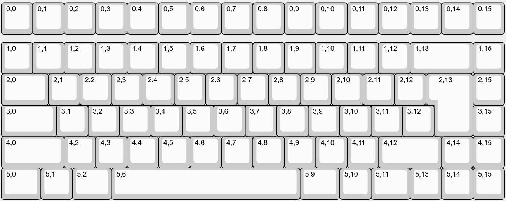

# CKB84
A DIY custom keyboard with 84 keys with per-key rgb and hotswappable keys.
Raspberry Pi RP2040 MCU.

## Features
- Hotswappable
- Per-key RGB Backlight
- 75% Layout
- QMK and Vial support
- 3D printed / CNC case and plate
- Custom layout : Backspace 2u, Left Shift 2u, Right Shift 2u, ISO Enter, Spacebar 6u

# Images

## Layout

## PCB

## Case and Plate
